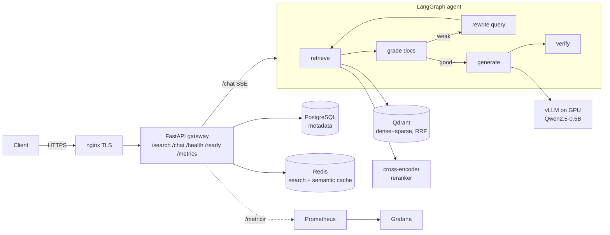

# RAGShip — Agentic RAG Platform

A production-shaped, GPU-served, observable, IaC-provisioned agentic RAG
platform — evolved from a semantic search engine as an AI-infrastructure
capstone. Everything runs locally for $0.

**Stack:** FastAPI · LangGraph · vLLM (Qwen2.5-0.5B-Instruct on GPU) · Qdrant
(hybrid dense+sparse + RRF) · cross-encoder reranking · PostgreSQL · Redis
(response + semantic cache) · nginx TLS · Prometheus · Grafana · Terraform ·
kind · Helm · GitHub Actions with a RAG-quality eval gate.

> **New here? Read [docs/HOW_TO_RUN.md](docs/HOW_TO_RUN.md)** — a step-by-step
> guide from zero to the full platform.

## Architecture



## Endpoints

| Endpoint | What it does |
|---|---|
| `POST /search` | Hybrid (dense+sparse, RRF) + reranked search; Redis-cached; `ENABLE_HYBRID` feature flag |
| `POST /chat` | Streaming (SSE) agentic RAG: retrieve → grade → generate → verify, grounded + cited |
| `GET /health` | Liveness probe |
| `GET /ready` | Readiness probe |
| `GET /metrics` | Prometheus metrics: latency, tokens, cache hits, per-node graph timing |

## Quick start (compose)

```bash
# secrets + TLS (one time)
echo "changeme_strong_password" > secrets/db_password.txt
bash nginx/generate-certs.sh

# core stack
docker compose up -d --build

# GPU LLM tier (needs NVIDIA GPU + Docker GPU support)
docker compose --profile gpu up -d

# monitoring (Grafana at http://localhost:3000, admin/admin)
docker compose --profile monitoring up -d

# ingest the corpus
docker compose exec api python -m src.ingest

# search
curl -k -X POST https://localhost/search -H "Content-Type: application/json" \
  -d '{"query": "container orchestration", "limit": 5}'

# chat (streams tokens)
curl -k -N -X POST https://localhost/chat -H "Content-Type: application/json" \
  -d '{"query": "What is Kubernetes used for?"}'
```

## One-command Kubernetes platform

```bash
cd infra/terraform
terraform init && terraform apply      # kind cluster + Qdrant + Postgres + Redis + app
terraform destroy                      # clean teardown
```

See [docs/HOW_TO_RUN.md](docs/HOW_TO_RUN.md) § Kubernetes for the image-load
and ingest steps.

## Quality gate

`python -m eval.run_eval --threshold 0.8` scores retrieval hit-rate, context
coverage, and (with `--with-llm`) answer/citation accuracy against
[eval/golden.jsonl](eval/golden.jsonl). CI runs it on every push — a quality
regression turns the build red before it can merge.

## Docs

- [How to run everything](docs/HOW_TO_RUN.md)
- [Live test run notes](docs/TEST_RUN_NOTES.md) — what broke on a real run and how it was fixed
- ADRs: [hybrid retrieval](docs/adr/0001-hybrid-retrieval.md) ·
  [host-GPU vLLM](docs/adr/0002-host-gpu-vllm.md) ·
  [eval gate](docs/adr/0003-eval-gate.md) ·
  [plain manifests over Bitnami](docs/adr/0004-plain-manifests-over-bitnami.md) ·
  [pin vLLM version](docs/adr/0005-pin-vllm-version.md) ·
  [k8s Service env collision](docs/adr/0006-k8s-service-env-collision.md)
- [Design review Q&A](docs/design-review.md)
- [Capstone runbook](AI-Infra-Capstone_Runbook_v1.md) — the phase-by-phase build plan
